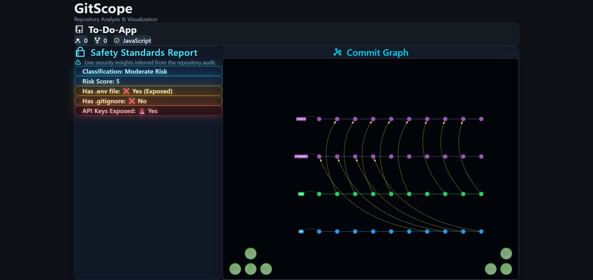
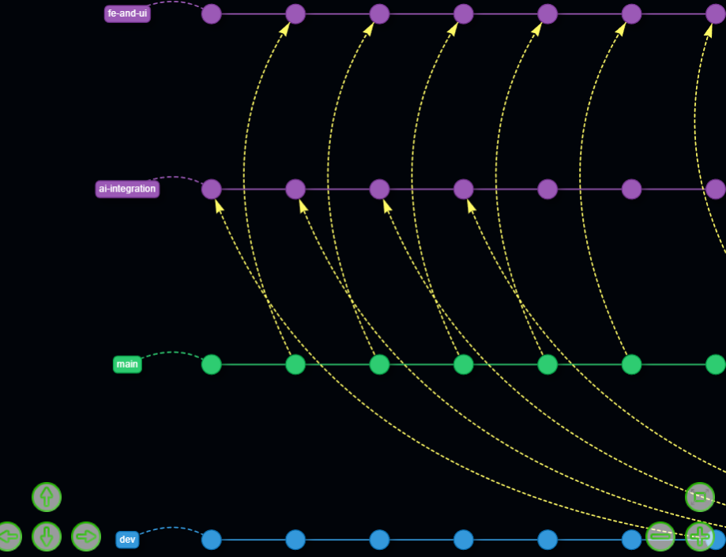
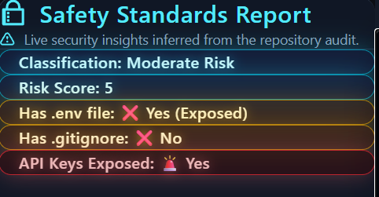

<div align="center">

# GitScope

Repository Analysis & Visualization

<!-- Overview image placeholder -->


</div>

## Overview

GitScope is a two-part local tool:

1. **`gitScope.cpp` scanner** – pulls metadata from a GitHub repository and exports it to `repo.json`. It also performs a security sweep that checks for:
   - **Classification** – “Safe / Moderate Risk / High Risk” based on cumulative findings.
   - **Risk Score** – integer value that increases as secrets, missing ignores, or dependency folders are detected.
   - **Has .env file** – flags exposed environment files anywhere in the tree.
   - **Has .gitignore** – warns when it’s missing at the root or inside nested folders.
   - **API Keys Exposed** – surfaces filenames containing `key`, `token`, `secret`, etc.

2. **React + Vite frontend** – reads `repo.json` from disk and renders:
   - A **Commit Graph** panel (see sample below) that visualizes branches, merges, and commit ordering.
   - A **Safety Standards Report** (sample below) that mirrors the scanner’s fields with glowing status rows.

<!-- Graph image placeholder -->


<!-- Safety audit image placeholder -->


## Getting Started

This is a local-only workflow: the frontend simply fetches `repo.json` from the project root, so there is no backend server.

### 1. Compile the scanner

You’ll need g++ with libcurl and OpenSSL development headers.

```bash
g++ gitScope.cpp -o gitscope -lcurl -lssl -lcrypto
```

- The repository already includes a prebuilt `gitscope` executable, but **recompile with the command above whenever you change `gitScope.cpp`.**
- Run the scanner and follow the prompt for a GitHub repository URL:

```bash
./gitscope
```

This produces `repo.json` in the project root.

### 2. Install and run the frontend

```bash
npm install
npm run dev
```

- The Vite dev server serves the React dashboard on `http://localhost:5173`.
- After each new `repo.json` export, refresh the browser to load the latest data.

## Project Layout

```
├─ gitScope.cpp          # C++ scanner and safety audit
├─ gitscope              # Compiled executable (rebuild after edits)
├─ repo.json             # Scanner output consumed by the frontend
├─ src/                  # React components (RepoInfo, CommitGraph, SafetyStandards, etc.)
└─ public/               # Static assets
```

Feel free to tailor the dashboard styling or extend the scanner, keeping the build command above handy whenever you tweak the C++ source.
